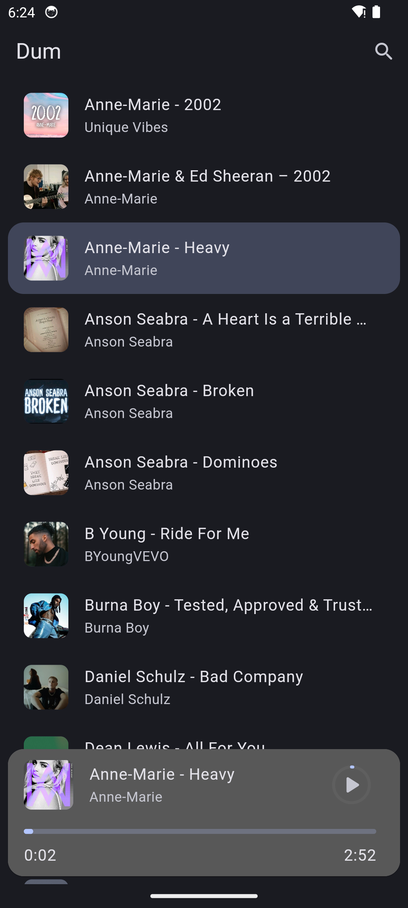
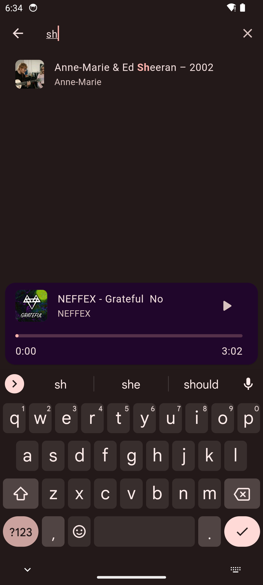
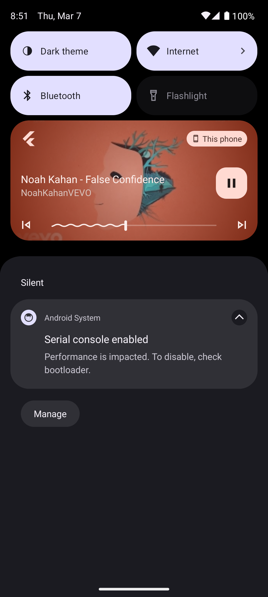

# Dum - Flutter Music Player App

Dum is a sleek and intuitive music player application built with Flutter,
designed to provide a seamless and enjoyable music listening experience. Whether
you're a casual listener or a music enthusiast, Dum offers a feature-rich
environment for managing and playing your favorite tunes.

## [View Video](https://youtu.be/_7CHcLhRh6E)

### Dynamic Themes - Wallpaper Matching

  

    
Theme 1

    
  

  

    
Theme 2

    
  

### Search Screen - Easily Find Your Favorite Tracks

Search Screen

  

### Notification - Seamlessly Handle Playback

Notification

  

